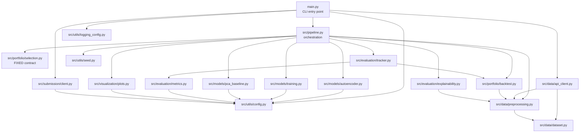
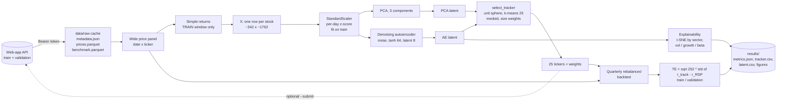
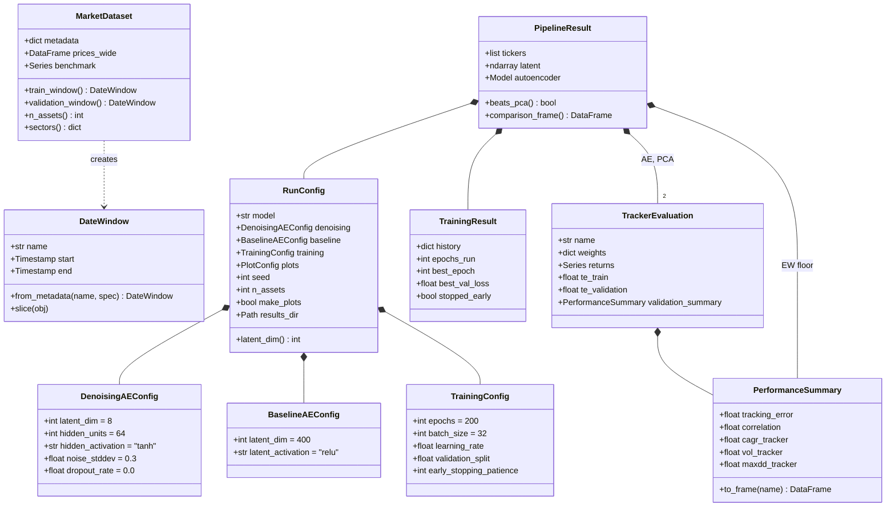

# Architecture

## 1. Project overview

The project builds a **sparse index tracker**: a 25-stock portfolio that
replicates the S&P 500 Equal Weight index (ETF **RSP**) with the lowest
possible out-of-sample tracking error. The 25 stocks are not hand-picked:
an **autoencoder** compresses each stock's daily return history into a
low-dimensional embedding. A fixed procedure then groups the embeddings
(spherical k-means), takes one medoid per group and weights it by group
size. The only free component is the autoencoder. It has to beat a linear
PCA baseline (the leaderboard's "ghost competitor") and sector-stratified
random portfolios ("monkeys").

## 2. Module dependency diagram



## 3. Data flow



Only the **training** window reaches the autoencoder. Validation (2022–2023)
is used for model selection only. Test (a random one-year window in
2024–2025) never leaves the server and is evaluated once, irreversibly.

## 4. Class diagram



## 5. Key design decisions

| Decision | Rationale |
|---|---|
| Denoising AE, latent 8, `tanh` 64, Gaussian noise 0.3 | Professor's reference. With about 342 samples and about 1762 features, a small regularised network generalises. A wide or deep one memorises. |
| Linear bottleneck | Signed coordinates and no dead ReLU units, so every stock has a direction for the cosine-based selection. |
| `StandardScaler` fitted on train only | Per-day cross-sectional z-score. Fitting on validation/test would be look-ahead leakage. |
| `selection.py` logic untouched | The server re-runs it to verify coherence. Any change gets the submission rejected. Its signature is covered by a unit test. |
| Seed 42 + TF op determinism | The server rejects other seeds. Determinism makes runs repeatable. |
| Local parquet cache | Offline, fast and reproducible reruns. Only the first run needs the token. |
| Token read from environment / `.env` | Keeps secrets out of the code and out of version control. |

## 6. How to run

```bash
python -m venv .venv                 # Python 3.11-3.13
source .venv/bin/activate            # Linux / macOS
.venv\Scripts\activate               # Windows
pip install -r requirements.txt
export MIAX_AE_TOKEN=<group token>   # first run only (or use .env)
python main.py                       # corrected denoising model
python main.py --model baseline      # original submission, for contrast
pytest                               # test suite (offline)
```
